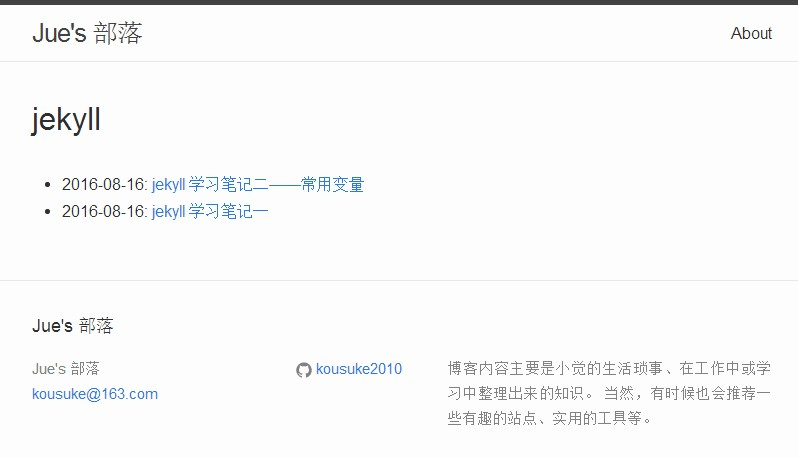

今天下午在捣鼓 `jekyll` 的时候想到稍微修改一下其主题，然后就想到需要添加一个 `tags` 的链接，但是发现其一开始是没有提供标签页面的，需要自己去创建一下，然后就先找到了一个无插件添加标签页的方法，但是对于用插件来添加还不知道，现在就先把无插件安装方法写出来吧。

首先需要在根目录下找到 `_layouts` 文件夹并在其中新建一个 `html` 文件，以 `tagpage.html` 或者带有相关性的名字命名即可，然后在其中填充以下代码：
`(请注意以下代码为了避免被 jekyll 所编译，所以在两个大括号之间加了个斜线.)`

```markdown
---
layout: default
---
<h1>{\{ page.tag }}</h1>

<ul>
{\% for post in site.tags[page.tag] %}
  <li>
    {\{ post.date | date: "%Y-%m-%d" }}: <a href="{\{ post.url }}">{\{ post.title }}</a>
  </li>
{\% endfor %}
</ul>
```

接着在根目录下新建 `tags` 文件夹，并在其中新建一个以 `tag` 名称命名的 `html` 文件，比如：`jekyll.html`，在其中填充以下代码：
`（注意以下代码中的 tag 值对应当前文件名称.）`

```markdown
---
layout: tagpage
tag: jekyll
---
```

最后就可以通过链接 `http://当前域名.com/tags/jekyll` 打开对应名称的 `tag` 单页面了，这里对应的是打开 `jekyll` 标签页.

附：最终效果图



>写在最后，如有疑问请通过站点底部邮箱给本人邮件，谢谢支持！
