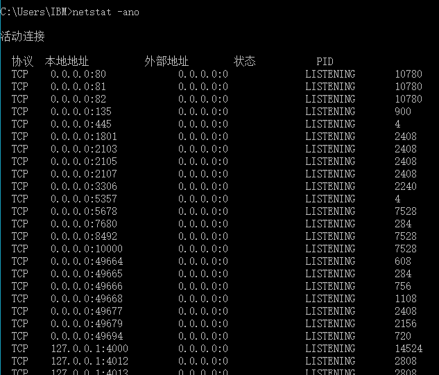
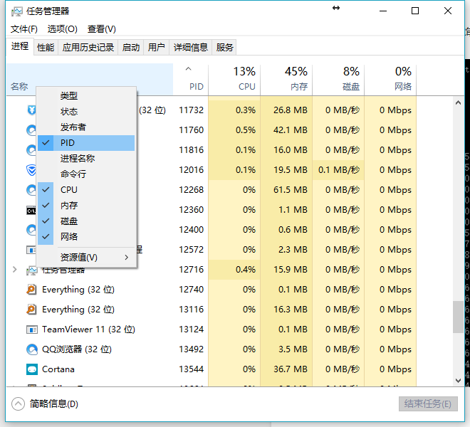

先看下完整的报错信息：

```ruby
Configuration file: D:/Github/myblog/_config.yml
            Source: D:/Github/myblog
       Destination: D:/Github/myblog/_site
 Incremental build: disabled. Enable with --incremental
      Generating...
                    done in 0.285 seconds.
  Please add the following to your Gemfile to avoid polling for changes:
    gem 'wdm', '>= 0.1.0' if Gem.win_platform?
 Auto-regeneration: enabled for 'D:/Github/myblog'
Configuration file: D:/Github/myblog/_config.yml
jekyll 3.1.2 | Error:  Permission denied - bind(2) for 127.0.0.1:4000
```

### 原因
4000 端口被占用

### 解决方法1

通过 `cmd` 的 `netstat -ano` 查询被占用线程 `PID`，然后删掉这个线程即可。





### 解决方法二
更换 `jekyll serve` 接口。（暂时不懂）
