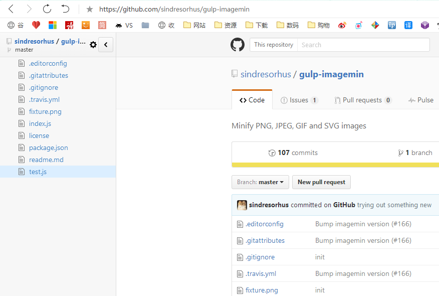
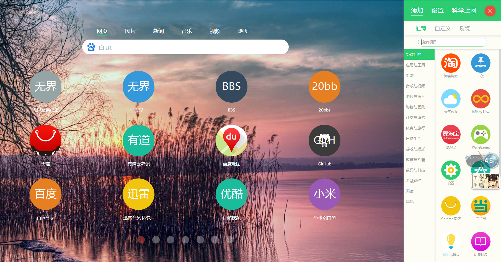
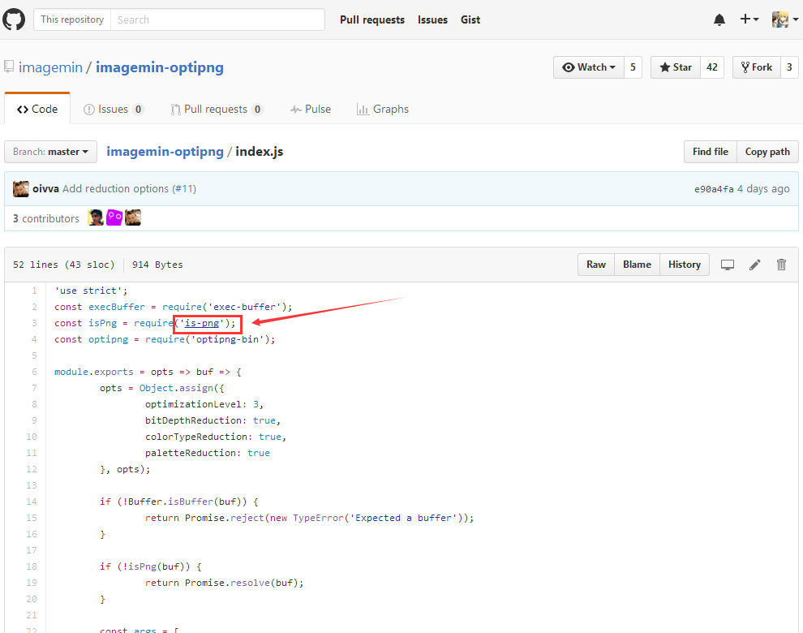

*由于国内的关系，也不喜欢翻墙，所以一般使用 Chrome 插件都是直接通过浏览器应用中心直接下载安装的，所以以下大部分都能够在应用中心安装，对于部分应用中心所没有的也会提供网盘等其他下载方式。*

### Octotree
做 Github 项目页面左侧生成一个目录以方便查看，专门针对国内 Github 不稳定问题。

### Infinity
一款新标签页，功能完善，漂亮直观，支持同步所存标签、背景、配置，反正是我一直在使用的。

### Adblock Plus
必备广告屏蔽插件。

### LastPass
密码管理工具，不过对于一些财富相关的记录在脑子里就好了，主要是在一些小网站中进行记录。

### 划词翻译
迄今为止能找到的最好用的翻译工具，配置很多，翻译工具包含谷歌国内外翻译、有道翻译、必应翻译。

### 有道云笔记网页剪报
平时使用有道云笔记并且经常找到一些好干货又没时间及时看的可以用起来。

### 网址二维码生成器
没什么特别的，就是生成的二维码显示比较大，没有其他干扰信息。

### 1px
让设计稿直接以透明的形式呈现在页面最上层以方便页面和设计稿之间的对比。

### User Agent
切换浏览器的 ua ，一键模拟各种浏览器和手机浏览器，开发者必备助手。

### Github Widescreen
Github 页面变宽工具，呵呵……

### OctoLinker
在 Github 项目中打开一个 js 文件，其中包含 require 调用插件时，在其值上提供对应项目链接，如：[https://github.com/imagemin/imagemin-optipng/blob/master/index.js](https://github.com/imagemin/imagemin-optipng/blob/master/index.js)

### WEB前端助手(FeHelper)
百度FE出品，包括字符串编解码、代码压缩、美化、JSON格式化、正则表达式、时间转换工具、二维码生成器、编码规范检测、页面性能检测、页面取色。
